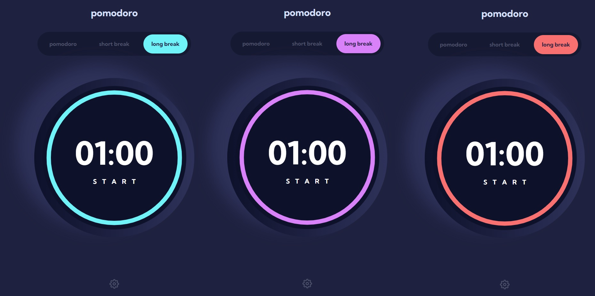

# Pomodoro App

## Introduction

Welcome to the Pomodoro App! This simple and effective productivity tool helps you stay focused, manage your time efficiently, and boost your productivity. With customizable color themes and font options, you can personalize your Pomodoro experience and make it visually appealing.

## Demo

Check out the [live demo](https://nityapasrija-pomodoro.netlify.app/) of the Pomodoro App to see it in action!

## Features

- **Pomodoro Timer**: The app follows the Pomodoro Technique, consisting of work intervals followed by short breaks to maximize productivity.
- **Customizable Timer Duration**: Adjust the work and break durations according to your preferences and workflow.
- **Color Time Customization**: Choose from a range of vibrant color themes to create a visually stimulating environment that matches your taste and energizes your work sessions.
- **Font Customization**: Select from a variety of fonts to create a visually pleasing and inspiring interface.

## Usage

1. Launch the Pomodoro App.
2. Set the timer according to your preferred work and break durations.
3. Click the "Start" button to initiate a work session.
4. Focus on your work until the timer ends.
5. Happy Pomodoro-ing :)

## License

The Pomodoro App is released under the [MIT License](LICENSE).

Let's maximize productivity and achieve great results with the Pomodoro App! Happy Pomodoro-ing!

